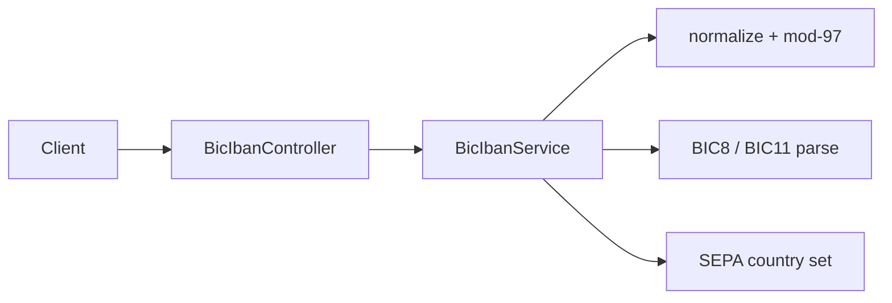

# BIC / IBAN Toolkit

Spring Boot toolkit for validating **ISO 13616 IBAN** (mod-97) and **ISO 9362 BIC** values, plus a simple SEPA country flag.

Inspired by the problem space of libraries such as [jbanking](https://github.com/marcwrobel/jbanking) (Apache-2.0). This repository is an independent educational implementation under MIT.

## Architecture



## Quick start

```bash
./mvnw test
./mvnw spring-boot:run
```

HTTP: `http://localhost:8084`

```bash
curl -s -X POST http://localhost:8084/api/iban/validate \
  -H "Content-Type: application/json" \
  -d "{\"value\":\"DE89 3704 0044 0532 0130 00\"}"

curl -s -X POST http://localhost:8084/api/bic/validate \
  -H "Content-Type: application/json" \
  -d "{\"value\":\"DEUTDEFFXXX\"}"
```

## License

[MIT](LICENSE)

## Notes

Educational demo for payment rails and onboarding checks.

