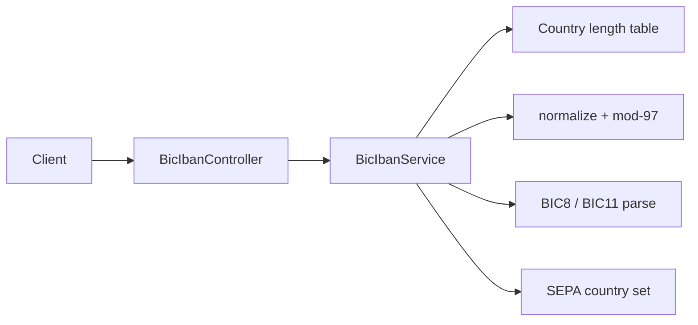

# BIC / IBAN Toolkit

Spring Boot toolkit for validating **ISO 13616 IBAN** (national length + mod-97) and **ISO 9362 BIC** (BIC8/BIC11), plus a SEPA country flag for the IBAN country code.

Inspired by the problem space of libraries such as [jbanking](https://github.com/marcwrobel/jbanking) (Apache-2.0). This repository is an independent educational implementation under MIT.

## Architecture



## API

| Method | Path | Description |
|--------|------|-------------|
| `POST` | `/api/iban/validate` | Body `{ "value": "DE89..." }` |
| `POST` | `/api/bic/validate` | Body `{ "value": "DEUTDEFF" }` |
| `GET` | `/api/health` | Liveness |

### IBAN response (success)

```json
{
  "iban": "DE89370400440532013000",
  "valid": true,
  "country": "DE",
  "sepa": true,
  "message": "OK"
}
```

Invalid results return HTTP 400 with the same shape and a `message` explaining length or mod-97 failure.

## Quick start

```bash
./mvnw test
./mvnw spring-boot:run
```

HTTP: `http://localhost:8084`

```bash
curl -s -X POST http://localhost:8084/api/iban/validate \
  -H "Content-Type: application/json" \
  -d "{\"value\":\"DE89 3704 0044 0532 0130 00\"}"

curl -s -X POST http://localhost:8084/api/bic/validate \
  -H "Content-Type: application/json" \
  -d "{\"value\":\"DEUTDEFFXXX\"}"
```

## Notes

- Length checks cover a common subset (DE, TR, GB, FR, NL, ES, IT, CH, AT, BE). Unknown countries still run mod-97 only.
- `GB` remains in the SEPA helper set for demo convenience; production SEPA reachability for UK accounts depends on scheme rules.

## License

[MIT](LICENSE)
