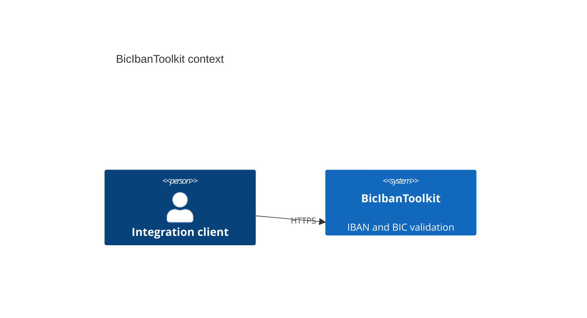
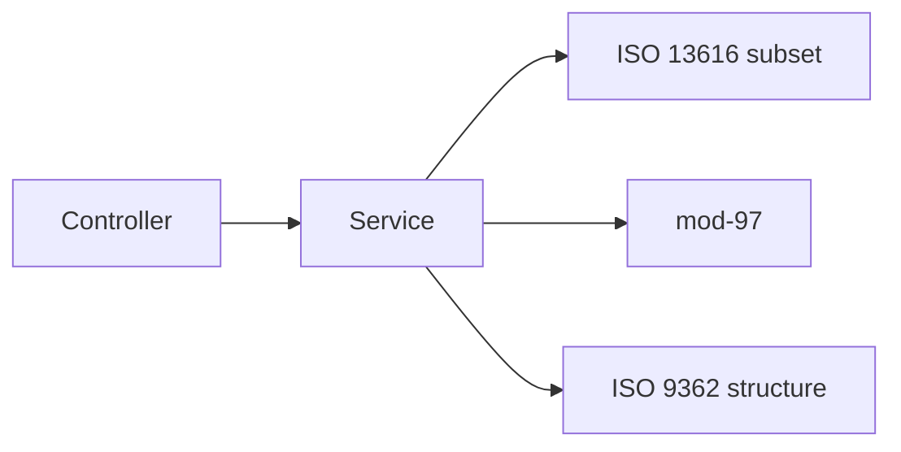

# Architecture

```mermaid
C4Context
  title BicIbanToolkit context
  Person(client, "Integration client")
  System(api, "BicIbanToolkit", "IBAN and BIC validation")
  Rel(client, api, "HTTPS")
```

```mermaid
flowchart LR
  Controller --> Service
  Service --> Lengths["ISO 13616 subset"]
  Service --> Mod97["mod-97"]
  Service --> Bic["ISO 9362 structure"]
```
The national-length table is an educational ISO 13616 subset. It does not replace the official ISO registry or a payment-scheme eligibility check.
