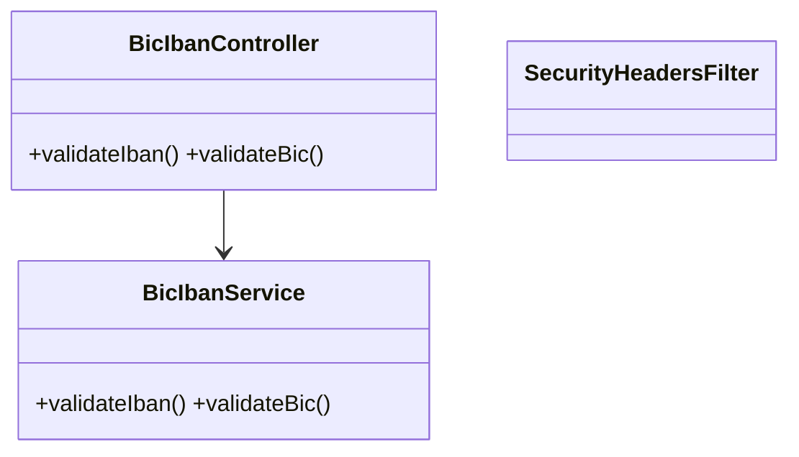
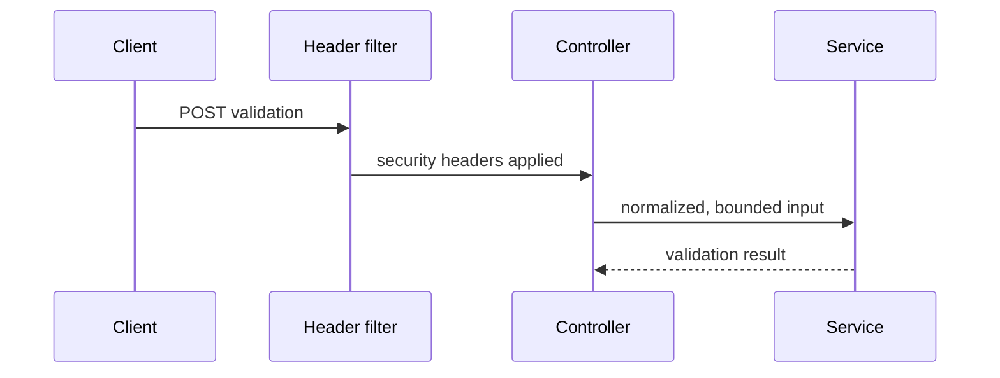

# UML

```mermaid
classDiagram
  class BicIbanController { +validateIban() +validateBic() }
  class BicIbanService { +validateIban() +validateBic() }
  class SecurityHeadersFilter
  BicIbanController --> BicIbanService
```

```mermaid
sequenceDiagram
  participant C as Client
  participant F as Header filter
  participant A as Controller
  participant S as Service
  C->>F: POST validation
  F->>A: security headers applied
  A->>S: normalized, bounded input
  S-->>A: validation result
```
